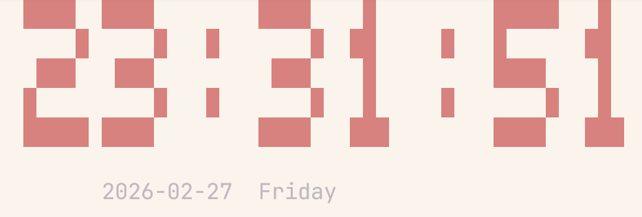

# Makefile Clock



A terminal clock written in GNU Make.  
It renders `HH:MM:SS` as large block digits and refreshes every second.

## Run

```bash
make -f Makefile.clock clock
```

Exit: `Ctrl+C`


## How It Works

- Reads current hour, minute, and second, then splits them into six digits.
- Defines digits and colons as 5×5 bitmap rows.
- Re-runs `make _draw` every second to refresh the display.
